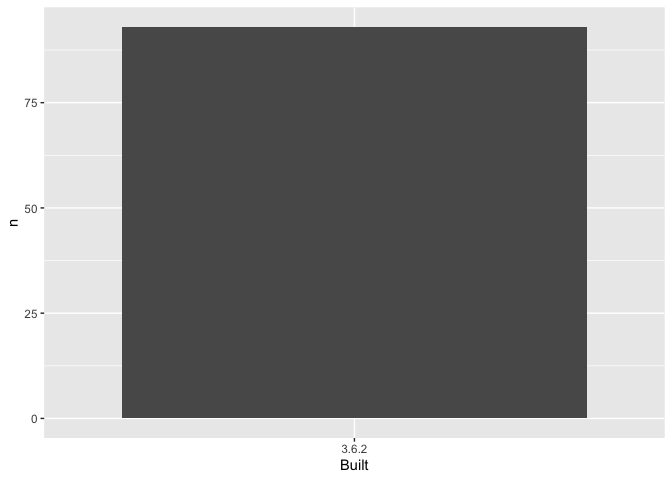

03\_barchart-packages-built.R
================
jprice
2020-01-27

``` r
## remember to restart R here!
library(ggplot2)
## make a barchart from the frequency table in data/add-on-packages-freqtable.csv

## read that csv into a data frame
## hint: readr::read_csv() or read.csv()
## idea: try using here::here() to create the file path
apt_freqtable <- read.csv(here::here("data", "add-on-packages-freqtable.csv"))

## if you use ggplot2, code like this will work:
ggplot(apt_freqtable, aes(x = Built, y = n)) +
  geom_col()
```

<!-- -->

``` r
## write this barchart to figs/built-barchart.png
## if you use ggplot2, ggsave() will help
## idea: try using here::here() to create the file path
ggsave(here::here("figs", "built-barchart.png"))
```

    ## Saving 7 x 5 in image

``` r
## YES overwrite the file that is there now
## that's old output from me (Jenny)

sessionInfo()
```

    ## R version 3.6.2 (2019-12-12)
    ## Platform: x86_64-apple-darwin19.2.0 (64-bit)
    ## Running under: macOS Catalina 10.15.2
    ## 
    ## Matrix products: default
    ## BLAS/LAPACK: /usr/local/Cellar/openblas/0.3.7/lib/libopenblasp-r0.3.7.dylib
    ## 
    ## locale:
    ## [1] en_US.UTF-8/en_US.UTF-8/en_US.UTF-8/C/en_US.UTF-8/en_US.UTF-8
    ## 
    ## attached base packages:
    ## [1] stats     graphics  grDevices utils     datasets  methods   base     
    ## 
    ## other attached packages:
    ## [1] ggplot2_3.2.1
    ## 
    ## loaded via a namespace (and not attached):
    ##  [1] Rcpp_1.0.3       pillar_1.4.3     compiler_3.6.2   highr_0.8       
    ##  [5] tools_3.6.2      digest_0.6.23    evaluate_0.14    lifecycle_0.1.0 
    ##  [9] tibble_2.1.3     gtable_0.3.0     pkgconfig_2.0.3  rlang_0.4.3     
    ## [13] yaml_2.2.0       xfun_0.12        withr_2.1.2      stringr_1.4.0   
    ## [17] dplyr_0.8.3      knitr_1.27       rprojroot_1.3-2  grid_3.6.2      
    ## [21] tidyselect_0.2.5 glue_1.3.1       here_0.1         R6_2.4.1        
    ## [25] rmarkdown_2.1    purrr_0.3.3      farver_2.0.3     magrittr_1.5    
    ## [29] scales_1.1.0     backports_1.1.5  htmltools_0.4.0  assertthat_0.2.1
    ## [33] colorspace_1.4-1 labeling_0.3     stringi_1.4.5    lazyeval_0.2.2  
    ## [37] munsell_0.5.0    crayon_1.3.4
